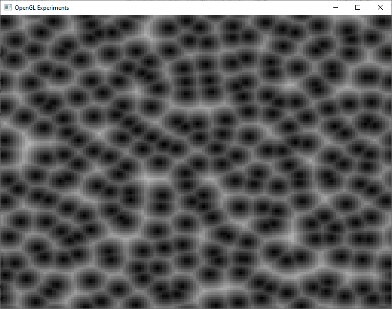
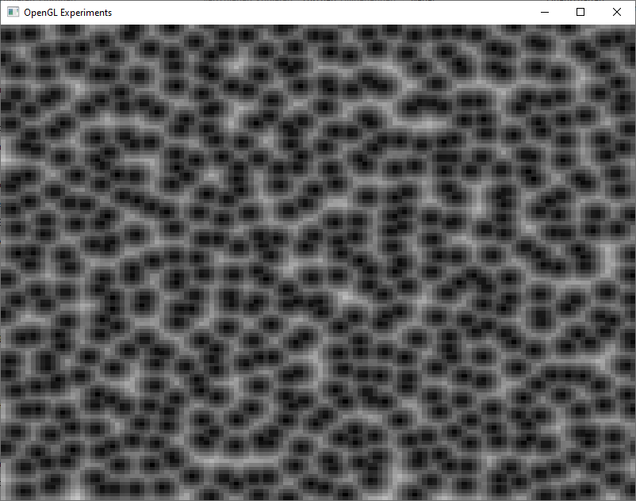
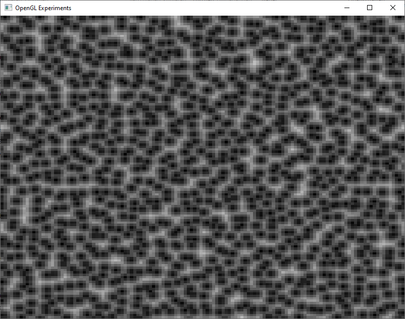
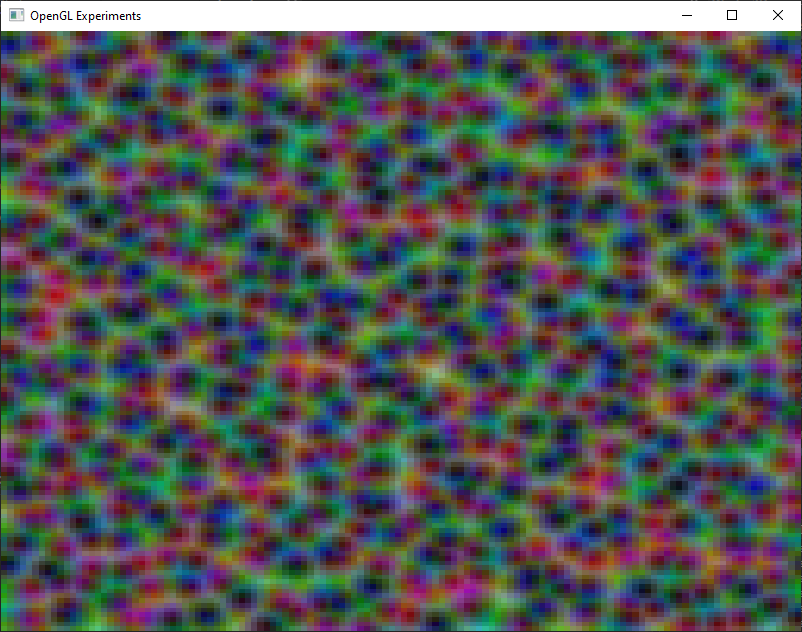

# Worley-Noise
This repo implements CPU generation of Worley Noise as described in <a href="https://dl.acm.org/doi/10.1145/237170.237267">A cellular texture basis function<a>. This code can both produce 2d and 3d Worley noise and creates a tilable texture.
The different texture channels can have different resolutions as seen in table below.

<table>
  <tr>
    <td> Red channel </td> <td> Green channel </td> <td> Blue channel </td> <td> Combined RGB Image </td>
  </tr>
  <tr>
    <td>  </td>
    <td>  </td>
    <td>  </td>
    <td>  </td>
  </tr>
</table>
